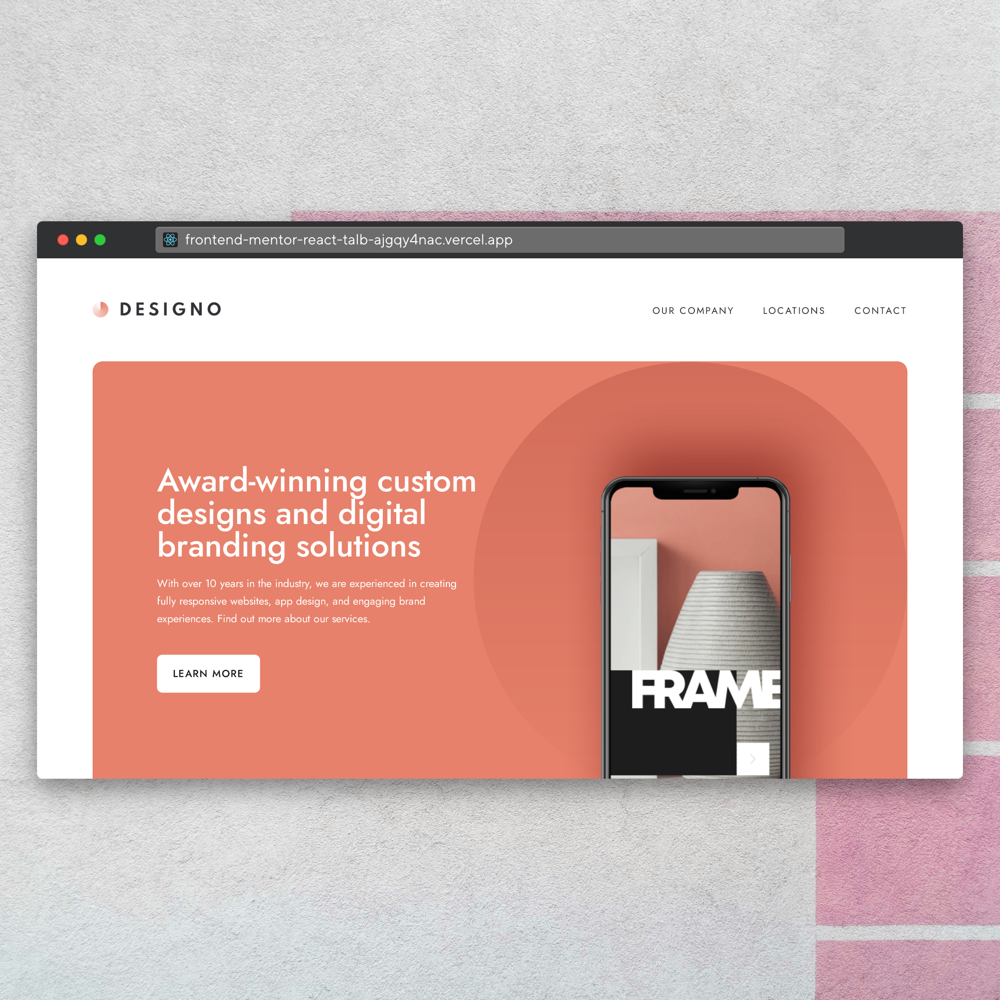
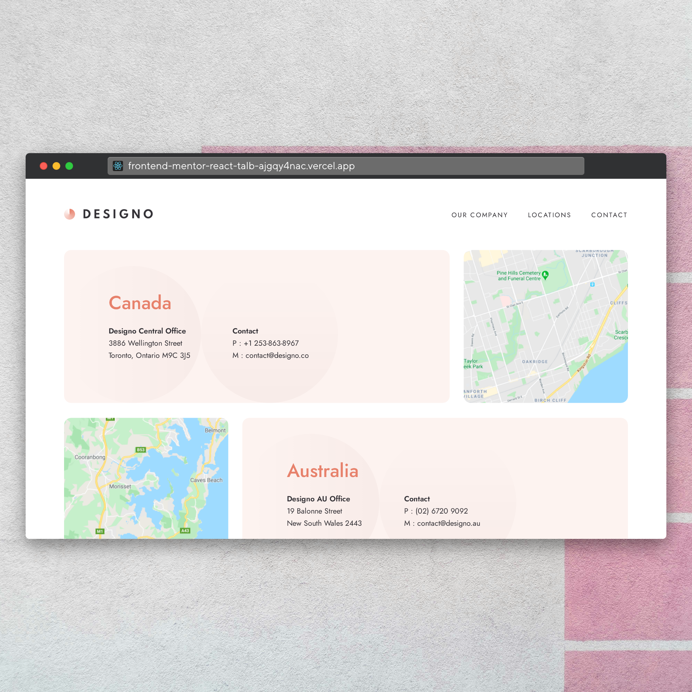
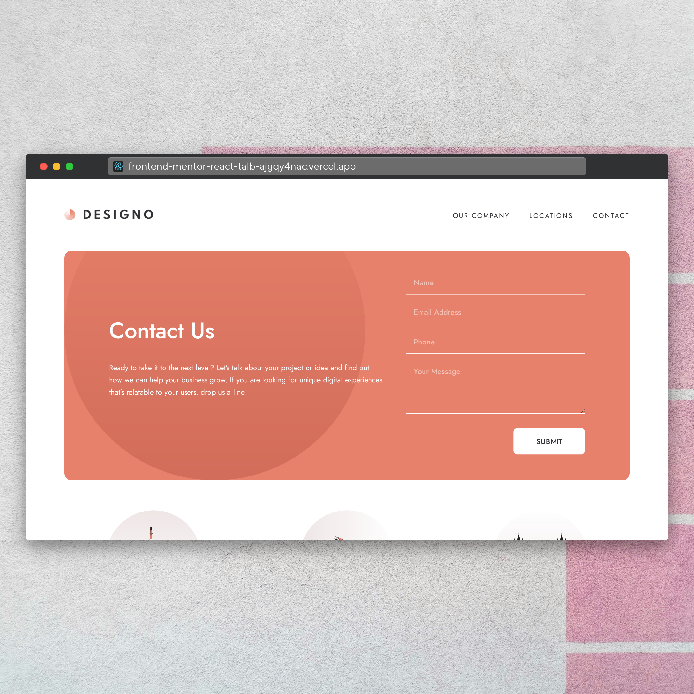
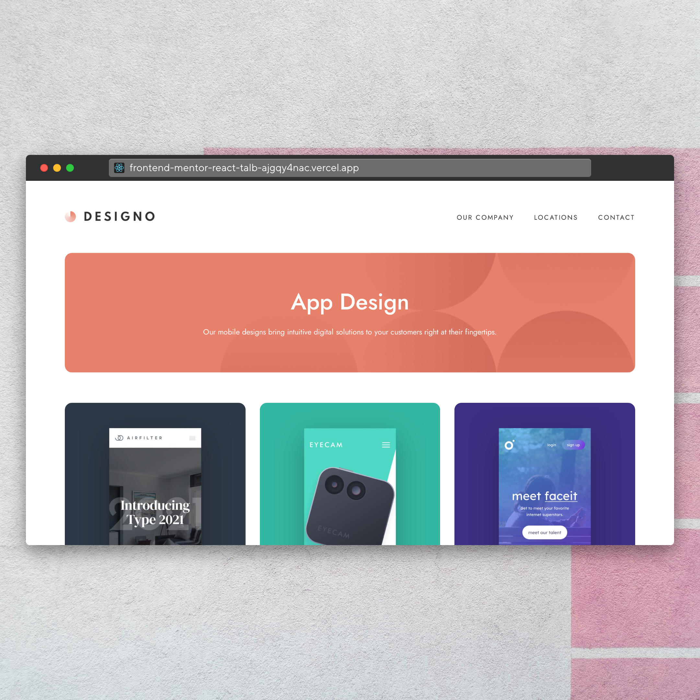

# Frontend Mentor - Designo agency website solution

This is a solution to the [Designo agency website challenge on Frontend Mentor](https://www.frontendmentor.io/challenges/designo-multipage-website-G48K6rfUT). Frontend Mentor challenges help you improve your coding skills by building realistic projects. 

### Table of contents

- [Overview](#overview)
  - [The challenge](#the-challenge)
  - [Screenshot](#screenshot)
  - [Links](#links)
- [My process](#my-process)
  - [Built with](#built-with)
  - [What I learned](#what-i-learned)
  - [Continued development](#continued-development)
  - [Useful resources](#useful-resources)
- [Author](#author)
- [Acknowledgments](#acknowledgments)

## Overview

### The challenge

Your challenge is to build out this multi-page website and get it looking as close to the design as possible.

You can use any tools you like to help you complete the challenge. So if you've got something you'd like to practice, feel free to give it a go.

Your users should be able to:

- View the optimal layout for each page depending on their device's screen size
- See hover states for all interactive elements throughout the site
- Receive an error message when the contact form is submitted if:
  - The `Name`, `Email Address` or `Your Message` fields are empty should show "Can't be empty"
  - The `Email Address` is not formatted correctly should show "Please use a valid email address"

### Screenshot

### Links

- Solution URL: [Solution URL](https://www.frontendmentor.io/solutions/responsive-designo-agency-website-solution-using-react-js-and-typescript-t0cour5SYR)
- Live Site URL: [Live URL](https://frontend-mentor-react-talb-ajgqy4nac.vercel.app/designo-multi-page/)

## My process

### Built with

- Semantic HTML5 markup
- CSS custom properties
- Flexbox
- CSS Grid
- Mobile-first workflow
- [React JS](https://reactjs.org/) - JS library
- [Typescript](https://www.typescriptlang.org/)
- [Vercel](https://vercel.com/) - For Deployment

### What I learned

- Writing Semantic HTML5 markup
- CSS Flexbox & Grids
- Mobile-first workflow
- JS Form Validatio
- Gained more experience with building reusable UI components, managing state with hooks, and working with props
- Improved app performance through effective component rendering and lifecycle management
- Ensured type safety and reduced bugs by implementing static types
- Utilizing Vercel’s continuous integration and delivery (CI/CD) for fast and secure releases of Streamlined deployment process
- Optimized the app for production, handling environment variables and configuration

## Author

- Frontend Mentor - [@KrishnaVishwakarma1595](https://www.frontendmentor.io/profile/KrishnaVishwakarma1595)
- Codewars - [@krish_codewars_797](https://www.codewars.com/users/krish_codewars_797)