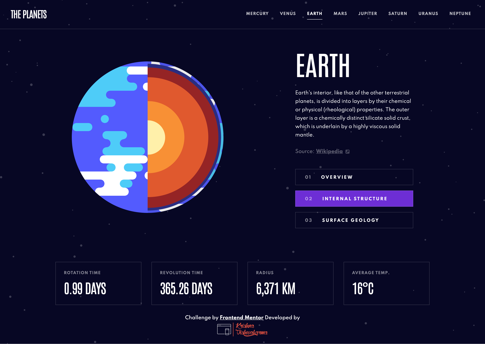
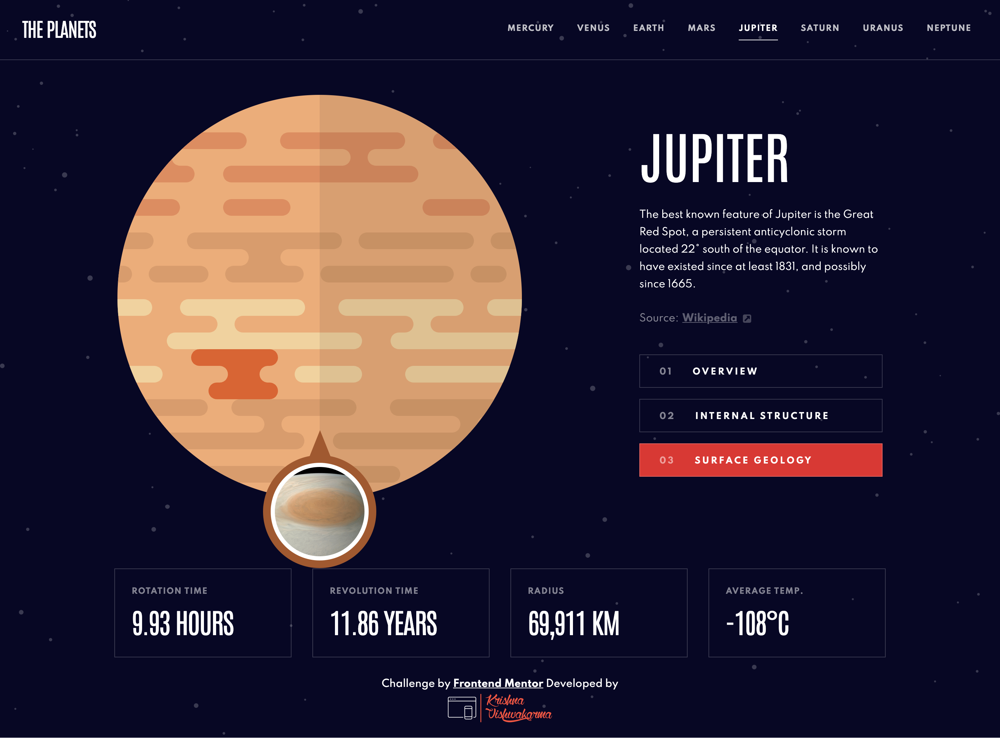
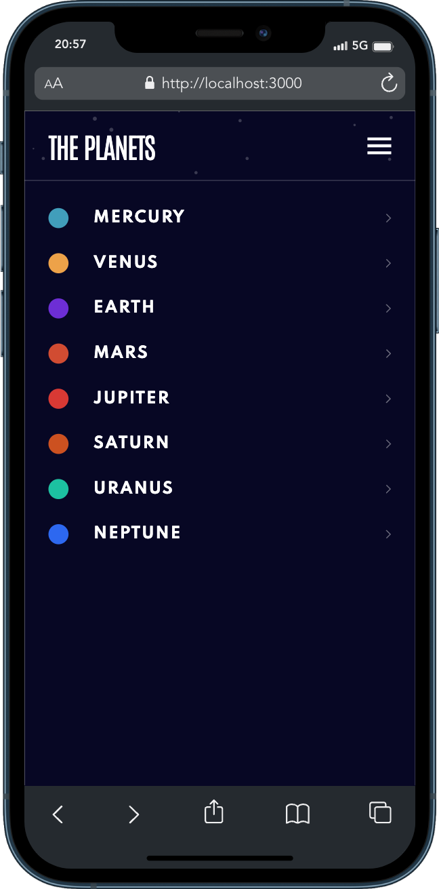

# Frontend Mentor - Planets fact site solution

This is a solution to the [Planets fact site challenge on Frontend Mentor](https://www.frontendmentor.io/challenges/planets-fact-site-gazqN8w_f). Frontend Mentor challenges help you improve your coding skills by building realistic projects. 

## Table of contents

- [Overview](#overview)
  - [The challenge](#the-challenge)
  - [Screenshot](#screenshot)
  - [Links](#links)
- [My process](#my-process)
  - [Built with](#built-with)
  - [What I learned](#what-i-learned)
  - [Continued development](#continued-development)
  - [Useful resources](#useful-resources)
- [Author](#author)
- [Acknowledgments](#acknowledgments)

**Note: Delete this note and update the table of contents based on what sections you keep.**

## Overview

### The challenge

Users should be able to:

- View the optimal layout for the app depending on their device's screen size
- See hover states for all interactive elements on the page
- View each planet page and toggle between "Overview", "Internal Structure", and "Surface Geology"

### Screenshot

### Links

- Solution URL: [Solution URL](https://www.frontendmentor.io/solutions/responsive-planets-fact-site-using-react-js-yVYX92Ov1z)
- Live Site URL: [Live URL](https://frontend-mentor-react-krishnavishwakarma1595.vercel.app/planets-fact-site)

## My process

### Built with

- Semantic HTML5 markup
- CSS Flexbox
- CSS Grid
- Mobile-first workflow
- [React](https://reactjs.org/) - JS library

### What I learned

- Semantic HTML5 markup
- CSS Flexbox & Grid
- Mobile-first workflow
- [React](https://reactjs.org/) - JS library
- [React Router DOM](https://reactrouter.com/en/main)
- [Deployement on Versel](https://vercel.com/guides/deploying-react-with-vercel)

## Author

- Frontend Mentor - [@KrishnaVishwakarma1595](https://www.frontendmentor.io/profile/KrishnaVishwakarma1595)
- Codewars - [@krish_codewars_797](https://www.codewars.com/users/krish_codewars_797)